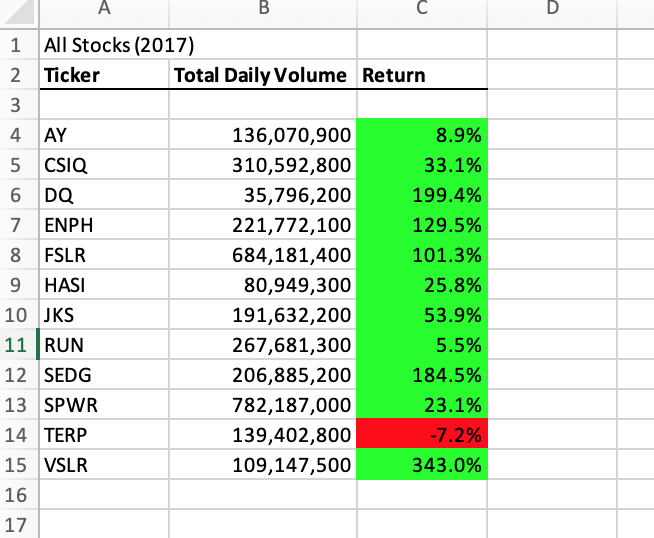
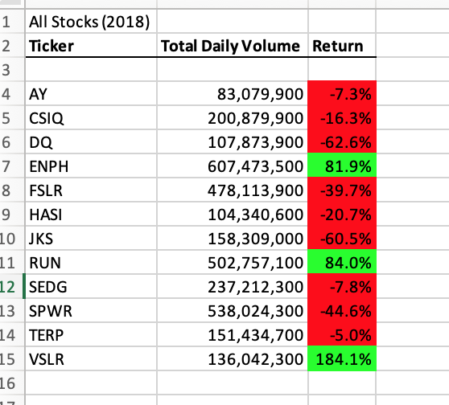
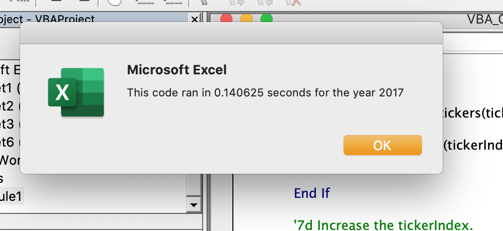
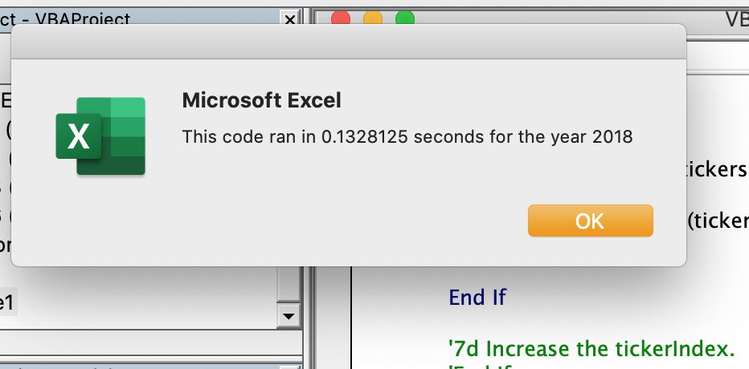

# stock-analysis
Steve's Stock Project
## Overview of Project

### Purpose
A recent graduate, Steve, is passionate about stock market and he is keen to find out the overall performance for a set of 12 stocks over the two-year duration from 2017 to 2018. in this assignment, we will help him to examine the investment result for the given list of stocks and we will also discuss the data strategy and methods we used in this assignment and their pros and cons.

## Analysis and Challenges
Before we started our data analysis, we will first give a brief discussion about the dataset that is given. The data set consist of two worksheet, "2017" and "2018", collected based on the year of stock price. Each of the worksheet include 12 identical stocks and both of the sheets have 3012 rows of data. This data includes trading date, opening value, closing value and daily volume. We will conduct our research based on the opening/closing value and its sum of volumes for each stock in each year.

### Analysis of Stock Performance
It's hard to say whether or not one object outperforms the other; however in the stock market, things are much more straightforward. The measurement of a stock performance is many times solely depends on how much the stock price has raised over the period of time. 

We began our research by first looking at individual stock's performance based on data included in worksheet"2018". We choose stock "DQ" as our first attempt. As we have over 3000 rows in one worksheet, we introduced For - next function to help us loop over the rows. And then "If-Then" function was inserted in the loop function as they are setting up criteria to the data so we can select the ones that fits in our expectation. Those functions coded together are called as "Nested Loops". As the data was recorded and sorted based on the assorting date, we used the below function to calculate the ratio of starting price and closing price. The logic behind this code is that: if the ticker in previous rows's column B are different than the current row, then we conduct that the current row is the first row that has trading price for the ticker. Thus we take the closing price at this row as the starting prices. Same logic applied to the closing price: if the next row's column B does not have the same ticker as we have in the current row, then we conduct the current row as the closing price as this is the last row has the trading price for this ticker.
````
                If Cells(j, 2).Value = ticker And Cells(j - 1, 2).Value <> ticker Then                   
                    startingprice = Cells(j, 7).Value
                End If              
                If Cells(j, 2).Value = ticker And Cells(j + 1, 2).Value <> ticker Then                  
                    endingprice = Cells(j, 7).Value               
                End If
``````
### Result: Stock Performance in 2017 and 2018
After applying the same method to all the 12 stocks, we came up with the below two charts. And we formatted the colour of cells’ background based on whether or not the percentage change is positive or negative. 





it is clearly from the graph 1 that 11 of the total 12 stocks shows a strong performance as they all have increase in their price. Top three performance will be DQ, SEDG and ENPH. Only one stock TERP shows negative changes. However in graph 2, most of the stocks experienced drop in their price and only ENPH and RUN shows remarkable increase in their price with +81.9% and +84%. 

### Result: Execution time of original script and refactored
Worth to discuss that under the nested loop method, the execution time is roughly around 0.67 seconds for 2018 and 0.66 seconds for 2017. It may seem to be very quick and acceptable time of execution at the first glance; however imagine if we are handling a massive dataset which consists of more than 1000 stocks, the execution time under the current model may be much more bigger and therefore we need to refactor the model so that it can be more comfortable with dealing large set of data. 




The way the nest loops works is that: for stock ticker equals to “DQ”, the function search the whole sheet and select those data that fits in our conditions. And once “DQ” is done, they move on to the next stock ticker and search the whole sheet again. And that’s the reason why the execution time can be long because the worksheet gets searched over and over again. One way to refactor this model is to avoid repeating the same step. Since the stocks’ data are organized in assorting order based on the stock symbol, we want to treat this sheet as a list of 12 areas. For example from the second row to the 250th row, all the rows only contains information for stock “AY”. So we set this areas as the “0” index in the list of 12 areas. We only use one loop function to search the worksheet until all the “AY” has been identified then we move to the “1”index area and search the rest of the worksheet. Until the “11”index area is done, the whole sheet get only looped for once but we finished our job. 

The following codes help us to do so: 
````
     Dim tickerStartingPrices(12) As Single
     Dim tickerEndingPrices(12) As Single
     Dim tickerVolumes(12) As Long
     Dim i As Integer
````

These will help us to declare our result as arrays instead of variable and arrays allow us to store information in this list. And introducing the variable “Tickerindex” will help us to refer the variable in the list of tickerVolumes, tickerEndingPrices and tickerStartingPrices.

 >             tickerVolumes(tickerIndex) = tickerVolumes(tickerIndex) + Cells(i, 9).Value

Unfortunately by far I wrote for this assignment, due to an unresolved bug I am still not able to run the codes successfully without error message. However, as we discussed and compared the way that the original script and refactored script work, I have no doubt that the refactored way will outperformed the original way as it was designed in a way that can successfully prevent analyzing data from repeating the same step over and over again. 

## Conclusion 
Refactoring code can help us to improve the efficiency of model by avoiding duplicate work. In our case, using output arrays to store a list of variable and using index to refer the variable of arrays can help our Marco save time from looping the sheet every time when it move to the next stock. However, it is very important to point out that in our case, the data was sorted in order based on its first letter of its stock symbol. So that we can complete the code by treating them as “12 areas”. This method may not outperform the nested loop method in the case where the data was not as “organized” as ours. Also, refactoring may cause addition error during the time of coding and consume more time to build code than the “simple repeating” code. In my case I spent the whole night to figure out why the error message popped out even I fully understand the concept and the logic of why we are doing in this way.  
